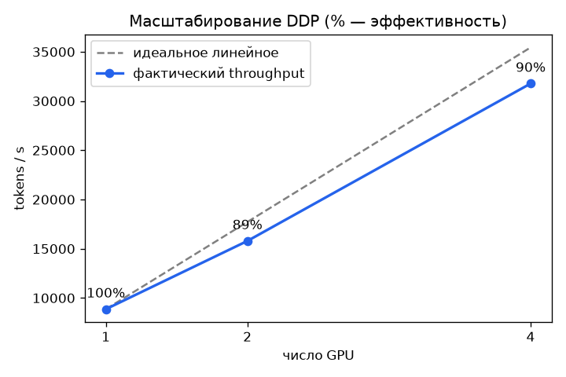

# mini-llm-distributed


Компактный GPT и обвязка распределённого обучения (DDP / FSDP): доказанная
корректность, измеримое масштабирование, явные ограничения железа.

> Акцент проекта — не SOTA-модель, а **правильная механика распределёнки** и умение
> её проверить. Корректность DDP доказывается численно на CPU, без GPU.

---

## Что доказано (проверяемо, без GPU)

| Проверка | Результат |
| --- | --- |
| **Корректность DDP** = одиночный процесс | `max\|grad_DDP − grad_single\| = 1.3e-08` |
| Тесты (модель, данные, DDP) | 6 passed |
| Throughput одиночного процесса (CPU, 0.8M параметров) | ~73 000 ток/с |

**Почему это важно.** DDP усредняет градиенты через all-reduce: каждый ранг считает
средний градиент по своей доле батча, и среднее средних (при равных долях) = общее
среднее по глобальному батчу. `tests/test_distributed.py` это **доказывает численно** —
DDP на 2 процессах даёт тот же градиент, что один процесс на полном батче.

```bash
python -m minigpt.distributed     # max |grad_DDP - grad_single| = 1.3e-08
```

---

## Таксономия параллелизма

| Стратегия | Что шардирует | Коммуникация | Когда применять |
| --- | --- | --- | --- |
| **DP / DDP** | ничего (полная копия модели на ранг) | all-reduce градиентов | модель влезает в 1 GPU, нужен throughput |
| **FSDP / ZeRO-3** | параметры + градиенты + состояние оптимизатора | all-gather + reduce-scatter | модель НЕ влезает по памяти |
| **Tensor parallel (TP)** | матрицы внутри слоя | all-reduce в каждом слое | огромные слои, быстрый интерконнект (NVLink) |
| **Pipeline parallel (PP)** | последовательные слои по устройствам | point-to-point между стадиями | очень глубокие модели; цена — «пузырь» конвейера |
| **Sequence parallel (SP)** | активации по длине последовательности | дополняет TP | длинный контекст |

### Когда что выбирать (коротко)
- Упёрся в **скорость**, память ок → **DDP**.
- Упёрся в **память** → **FSDP/ZeRO** (или TP, если интерконнект быстрый).
- Модель **глубокая**, не делится по памяти иначе → добавить **PP**.
- Огромные слои + NVLink → **TP**.
- Реальные большие прогоны комбинируют их — **3D-параллелизм** (DP × TP × PP),
  поверх FSDP/ZeRO для памяти.

---

## Запуск

```bash
pip install -r requirements.txt

python train_single.py                          # базовая тренировка (1 процесс)
python -m minigpt.distributed                   # доказательство корректности DDP
torchrun --nproc_per_node=2 train_ddp.py        # DDP (на CPU — gloo, для логики)
torchrun --nproc_per_node=4 train_fsdp.py       # FSDP (нужен GPU/nccl)
torchrun --nproc_per_node=4 bench/scaling.py    # точка кривой масштабирования
pytest                                          # тесты, включая корректность DDP
```

---

## Результаты — 4× NVIDIA A10 (24 ГБ, PCIe)

Снято одной командой `bash run_l2.sh` (см. [RUNBOOK](RUNBOOK_multigpu.md)).



### Масштабирование упирается в насыщение GPU, а не в число карт
Две кривые на одной и той же установке — главный инженерный вывод.

**Compute-bound** (модель 200M, batch 32, seq 512 — GPU реально загружены):

| GPU | tokens/s | эффективность |
| --- | --- | --- |
| 1 | 8 859 | 1.00 |
| 2 | 15 788 | **0.89** |
| 4 | 31 771 | **0.90** |

**Communication-bound** (мелкий эффективный батч — GPU недогружены):

| GPU | tokens/s | эффективность |
| --- | --- | --- |
| 1 | 19 515 | 1.00 |
| 2 | 19 315 | 0.49 |
| 4 | 32 651 | 0.42 |

→ При насыщении — почти линейно (**0.90 на 4 GPU даже по PCIe без NVLink**); при
недогрузе all-reduce съедает выигрыш. Масштабируемость — свойство нагрузки, не железа.

### Память: DDP vs FSDP (модель 200M, 4 GPU)

| | peak mem/GPU | tokens/s |
| --- | --- | --- |
| DDP (fp32) | 21.4 ГБ | 31 825 |
| FSDP (bf16 + FULL_SHARD) | **1.9 ГБ** | 73 894 |

FSDP шардирует параметры, градиенты и состояние оптимизатора по рангам → **~11× меньше
памяти**. FSDP здесь ещё и в bf16, так что выигрыш = шардирование + mixed precision
против fp32-DDP.

### OOM-демо: где DDP не может, а FSDP может (модель 1.6B, 4 GPU)

| | результат |
| --- | --- |
| DDP (fp32) | ❌ `CUDA out of memory` — не выделить даже состояние Adam (≈25 ГБ > 23) |
| FSDP (bf16 + shard) | ✅ обучается, peak **8.1 ГБ**/GPU |

Состояние Adam (m, v) для 1.6B в fp32 — это ~12.8 ГБ сверх параметров и градиентов.
DDP держит всё на каждом GPU и падает; FSDP делит на 4 ранга и влезает.

> **Железо.** Прогон — 4× A10 на **PCIe без NVLink**, поэтому эффективность ~0.9,
> а не ~1.0: all-reduce упирается в связь (на NVLink/NVSwitch было бы ближе к линейному).
> Корректность DDP проверяется отдельно на CPU/gloo
> (`max|grad_DDP−grad_single| = 1.3e-08`) и от железа не зависит.

### Ускорения одной GPU (`bench/optim.py`)

Лестница приёмов, каждый поверх предыдущего (модель 200M, A10):

| Оптимизация | tokens/s | ускорение |
| --- | --- | --- |
| fp32 baseline | 19 744 | 1.00× |
| + TF32 | 36 875 | **1.87×** |
| + bf16 (AMP) | 59 272 | **3.00×** |

TF32 и bf16 на Ampere дают **3× почти «бесплатно»** (точность для претрейна
достаточная). `torch.compile` в наборе тоже есть, но на этой dev-сборке torch упёрся
во внутренний баг Inductor — пропущен (обёрнут в `try/except`, прогон не падает).

---

## Подводные камни
- **PP «пузырь»** — простой устройств в начале/конце конвейера; лечится микробатчами.
- **all-reduce overhead** — на медленном интерконнекте DDP упирается в связь, не в счёт.
- **Grad accumulation × DDP** — синхронизировать только на последнем микрошаге
  (`no_sync()`), иначе лишний all-reduce.
- **Tied weights × DDP** — общий параметр может ломать reducer; в тесте корректности
  weight tying отключён намеренно (`tie_weights=False`).

---

## Структура
```
mini-llm-distributed/
├── src/minigpt/
│   ├── model.py          # компактный GPT (causal attention, weight tying)
│   ├── data.py           # char-level датасет (встроенный, без скачиваний)
│   └── distributed.py    # measure_ddp_vs_single — доказательство корректности
├── train_single.py       # базовая тренировка
├── train_ddp.py          # DDP под torchrun (nccl/gloo)
├── train_fsdp.py         # FSDP: auto-wrap, bf16, activation checkpointing, FULL_SHARD
├── bench/scaling.py      # кривая throughput vs число GPU
├── bench/optim.py        # лестница ускорений: TF32 -> bf16 -> torch.compile
├── bench/plot.py         # рисует bench/scaling.png
├── run_l2.sh             # turnkey: всё разом на multi-GPU инстансе
├── tests/                # модель, данные, корректность DDP (gloo/CPU)
└── RUNBOOK_multigpu.md   # как получить реальные scaling-цифры на аренде
```

## Лицензия
MIT
